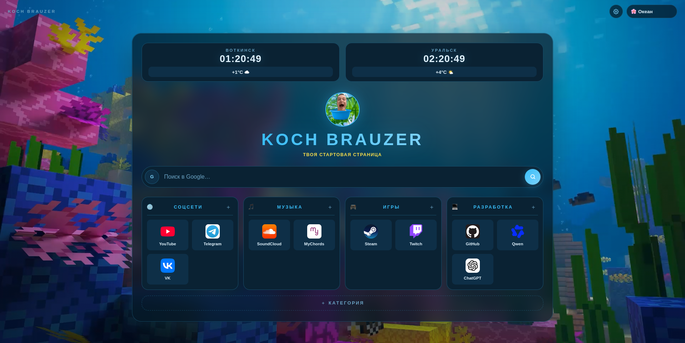
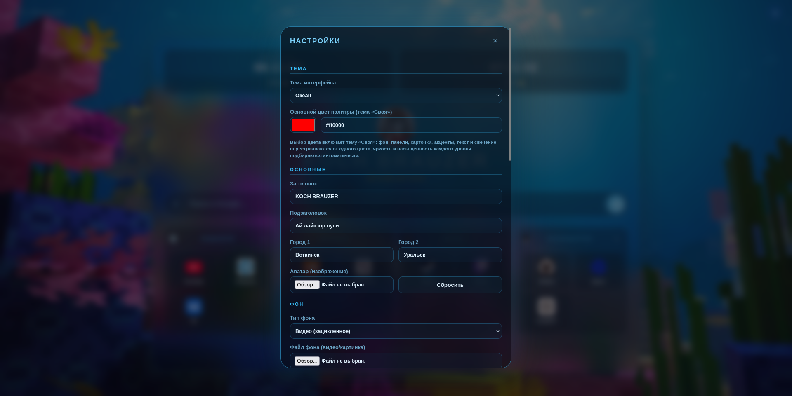
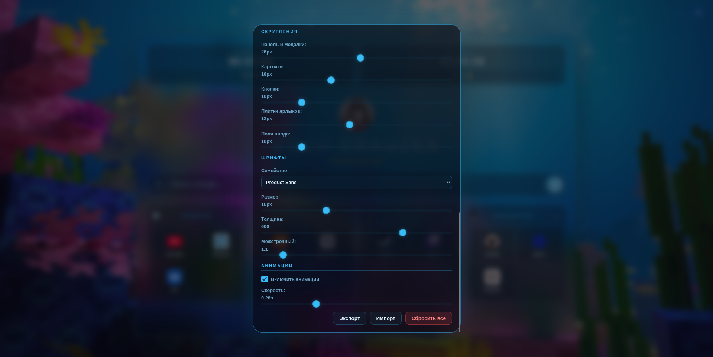

# KOCH BRAUZER

**Твоя стартовая страница.** Минималистичная, быстрая и глубоко настраиваемая страница новой вкладки для Mozilla Firefox.


> Неон, стекло — плюс полная кастомизация: темы, прозрачность, скругления, шрифты, анимации и фоновое видео. Без сборки, без зависимостей, без телеметрии.

---

## 📸 Скриншоты

<table>
  <tr>
    <td colspan="2">
      
    </td>
  </tr>
  <tr>
    <td width="50%">
      
    </td>
    <td width="50%">
      
    </td>
  </tr>
</table>

---

## ✨ Возможности

| | |
|---|---|
| 🕐 **Погода** | любые города, учёт часовых поясов, эмодзи-погода (open-meteo) |
| 🔎 **Умный поиск** | 5 движков (Google, DDG, Bing, Яндекс, Brave), история с подсказками, автоопределение URL |
| 🗂 **Категории и ярлыки** | создание, редактирование, drag & drop категорий и плиток, favicon / эмодзи / своя иконка |
| 🎨 **8 тем** | Rose, Purple, Ocean, Green, Dark, Light, Midnight, Sunset |
| 🧩 **Кастомизация** | прозрачность панелей/карточек/фона, скругления 5 элементов, семейство/размер/толщина/межстрочный шрифта, скорость анимаций |
| 🖼 **Фон** | неоновые орбы (по умолчанию), видео или изображение + прозрачность и размытие |
| 👤 **Аватар** | своё изображение (автосжатие до 256px) или неоновая заглушка |
| 💾 **Бэкапы** | экспорт/импорт всех настроек одним JSON-файлом |

---

## ⚡ Почему это быстро

- **Один модуль** `scripts/app.js` — никаких гонок между скриптами и лишних запросов.
- **Одно чтение хранилища на запуск** + кэш настроек в памяти.
- **Часы рисуются мгновенно**, геокодинг и погода догружаются в фоне.
- **Медиафайлы живут в IndexedDB** (блобы), а не base64 в настройках — нет раздувания хранилища и просадок при каждом изменении настроек.
- **Debounced-обработчики** и отсутствие лишних observers/interval'ов.

---

## 🚀 Установка

### https://addons.mozilla.org/ru/firefox/addon/koch-brauzer/

> Расширение заменяет стандартную страницу новой вкладки — просто открой новую вкладку.

---

## 🎨 Темы

| Rose | Purple | Ocean | Green |
|---|---|---|---|
| **Dark** | **Light** | **Midnight** | **Sunset** |

Переключаются в один клик в шапке; выбор сохраняется и переживает перезапуск браузера.

---

## 🗂 Структура проекта

```
koch-brauzer/
├── manifest.json      # Manifest V3, Firefox-first (gecko, data_collection_permissions)
├── background.js      # фоновый скрипт (открытие вкладки, onInstalled)
├── newtab.html        # разметка + ВСЕ стили (inline <style>, CSS-переменные)
└── scripts/
    └── app.js         # вся логика одним ES-модулем
```

---

## 🏗 Архитектура

- **Настройки** — `browser.storage.local` с версионной схемой (`schemaVersion`) и миграцией: после обновления расширения старые настройки не теряются, новые поля получают значения по умолчанию (deep-merge).
- **Медиа** — видео/картинки фона хранятся блобами в **IndexedDB**; в настройках остаётся только ссылка. Никаких лимитов на размер файла и никаких мегабайтных base64-строк в storage.
- **Синхронизация** — `storage.onChanged`: изменение настроек в одной вкладке мгновенно применяется во всех открытых.
- **Совместимость** — основной API `browser.*` (Firefox), с аккуратным фолбэком на `chrome.*` и `localStorage`, чтобы `newtab.html` можно было открыть просто в браузере без установки.
- **Приватность** — `data_collection_permissions.required: ["none"]`: расширение ничего не собирает. Всё хранится только локально.

### Сторонние сервисы
- [open-meteo.com](https://open-meteo.com) — погода и геокодинг городов (без API-ключа и без логов);
- `google.com/s2/favicons` — иконки ярлыков.

---

##  Контрибьют

Баги и идеи — в [Issues](../../issues).

---
